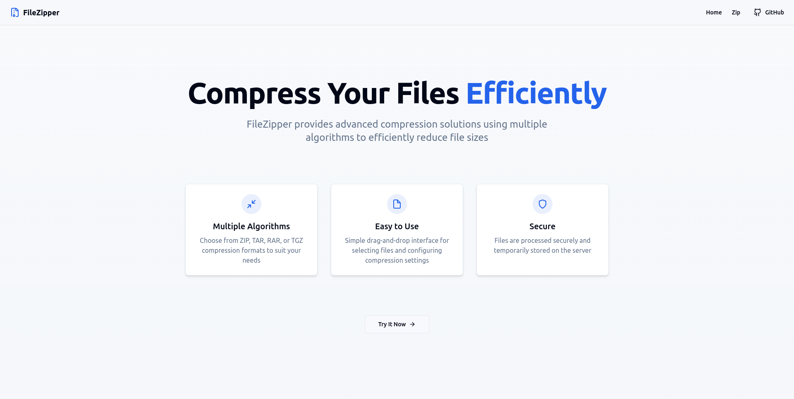
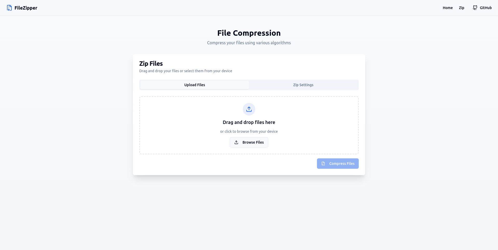
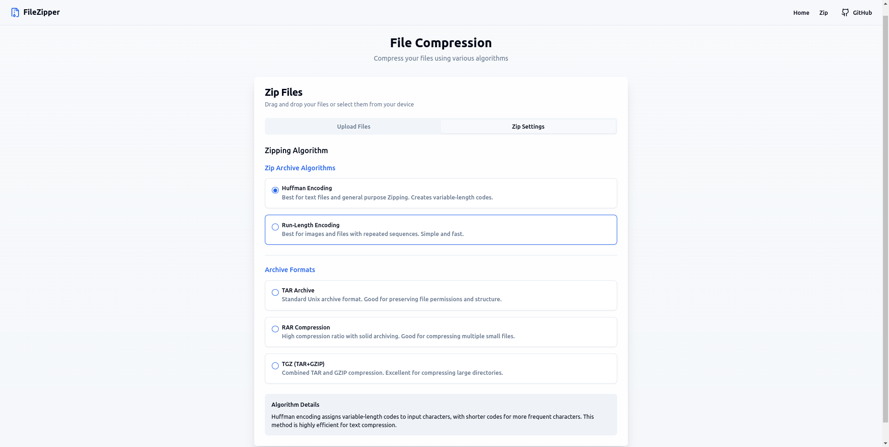

# File Zipper

## Overview

File Zipper is a web-based tool designed for compressing files or directories into a single compressed file using efficient algorithms like Greedy Huffman Encoding, Run-Length Encoding, RAR, TAR, or TGZ. This project aims to simplify file compression for general users who need an easy-to-use interface for reducing file sizes and facilitating file transfers.

## Features

- **Drag-and-Drop File Selection**: Easily drag and drop files into the interface for compression.
- **Compression Algorithms**: Choose between various compression formats such as Greedy Huffman Encoding, Run-Length Encoding, RAR, TAR, or TGZ for efficient file compression.
- **Customizable Compression Settings**: Configure the compression settings before initiating the process.
- **Progress Bar**: Visualize the compression process with real-time progress updates.
- **Temporary File Storage**: Files are temporarily stored on the server for processing and can be downloaded post-compression.

## Technology Stack

### Frontend
- **React**: Provides an interactive user interface with dynamic updates, including drag-and-drop functionality and progress tracking.
  
### Backend
- **Python (Flask/FastAPI)**: Handles the compression logic and manages file storage and processing.
  
### Compression Algorithms
- **ZIP**
  - **Greedy Huffman Encoding**: A lossless data compression algorithm that ensures efficient storage.
  - **Run-Length Encoding**: Simplifies the representation of repeating data, reducing file sizes.
- **RAR**: A proprietary archive format that offers high compression ratios and optional encryption. Often used for compressing large files and splitting archives into parts.
- **TAR**: A widely-used format for combining multiple files into a single archive. It doesn't compress files on its own but is often used in combination with compression algorithms (e.g., GZIP).
- **TGZ**: A combination of TAR and GZIP compression. It first combines files using TAR and then compresses them using GZIP, offering both archiving and compression.

### File Storage
- **Temporary Server Storage**: Files are stored temporarily on the server for processing and removed after download.

## Installation

### Prerequisites
Make sure you have the following installed on your machine:

- **Python 3.x** (for backend)
- **pip** (Python package manager)

### Steps to Set Up the Project

1. **Clone the Repository**
   ```bash
   git clone https://github.com/Priyanshu13104/sortify-simulations.git

2. **Frontend Setup**
   ```bash
   npm install
   npm run dev

3. **Backend Setup**
   ```bash
   cd backend
   pip install -r requirements.txt

4. **Launch Applicaiton**
    - Once both the frontend and backend are running, open your browser and go to http://localhost to start using the File-Zipper.

## Usage

  - Open the web application in your browser at `http://localhost`.

  - Drag and drop files into the designated area or select them manually.

  - Choose your preferred compression format (ZIP, RAR, TAR, TGZ) and adjust settings if needed.

  - Click the **Compress** button to start the process.

  - Once compression is complete, download your compressed file.
  <br>

## Preview
<br>

***Landing Page***

<br>

***Zip Page***

<br>

***Zip Settings***



## Contact

For any questions or feedback, please reach out at:

- **Email**: priyanshuprajapati13@gmail.com
- **GitHub**: [Priyanshu13104](https://github.com/Priyanshu13104)
